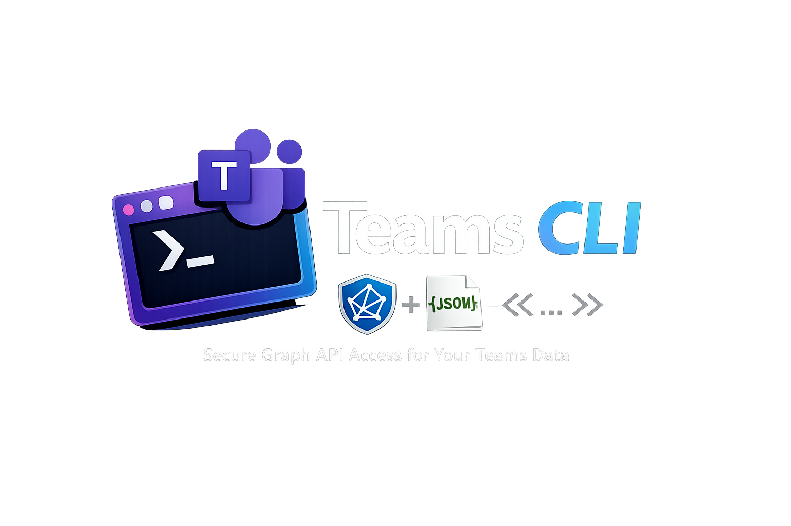

# Teams CLI



Read **Microsoft Teams** chats and messages from the terminal using the **Microsoft Graph API**. Sign in with an **Azure AD application** (MSAL client credentials + user ID) or paste a **Graph access token** you obtained elsewhere.

## Why teams-cli?

- Fast triage: inspect chats/messages from a shell without opening the Teams UI
- Scriptable JSON: `--json` makes it easy to pipe into `jq` and automation
- Focused scope: Teams chats/messages and Graph auth, without trying to be a full Graph client

## Features

- List chats and load messages via Graph (`/me/chats`, … or `/users/{id}/…` for app-only tokens)
- **`teams-cli init`** — store MSAL app credentials or a manual Bearer token in `~/.teams-cli/config.toml`
- **`teams-cli doctor`**, **`chats`**, **`messages`**, and raw **`request`** for paths under `https://graph.microsoft.com/v1.0/`
- Global flags: `--json`, `--api-key` (Bearer override), `TEAMS_CLI_TOKEN` env override

## Requirements

- **From source:** Go **1.22** (see `go.mod`)
- **MSAL path:** Azure AD app with **Application** permissions (see below), **admin consent**, and the target user’s **Graph user ID** for `/users/{id}/…`
- **Manual token path:** A JWT with a **Microsoft Graph** audience (`ValidateGraphToken` must accept it)

## Install

```bash
go install github.com/aeswibon/teams-cli@latest
```

### Prebuilt binaries

Download prebuilt binaries from GitHub Releases:

https://github.com/aeswibon/teams-cli/releases

**Build from source:**

```bash
git clone https://github.com/aeswibon/teams-cli.git
cd teams-cli
go build -o teams-cli .
```

## Quick start

```bash
teams-cli init   # see Authentication below
teams-cli doctor
teams-cli chats
teams-cli messages "CHAT_ID" --limit 50
```

JSON output: add **`--json`** to any command that prints structured data.

## Demo

To regenerate the demo GIF locally:

```bash
brew install vhs
vhs docs/demo.tape
```

## Authentication

### MSAL (Azure AD app, recommended for automation)

Uses **client credentials**. You must supply the **user ID** whose mailboxes/chats you access (app-only cannot use `/me`).

```bash
teams-cli init --use-msal \
  --msal-client-id "YOUR_CLIENT_ID" \
  --msal-client-secret "YOUR_CLIENT_SECRET" \
  --msal-tenant-id "YOUR_TENANT_ID" \
  --user-id "YOUR_GRAPH_USER_ID"
```

At init, the CLI fetches a Graph access token and saves it. When it **expires**, run **`teams-cli init`** again (or set `TEAMS_CLI_TOKEN` / `--api-key` with a fresh token).

### Manual Graph token

For delegated tokens you already have (e.g. from Graph Explorer):

```bash
teams-cli init --token "eyJ..."
```

## Usage

| Command              | Description                                                                                    |
| -------------------- | ---------------------------------------------------------------------------------------------- |
| `doctor`             | Check token and Graph connectivity                                                             |
| `chats`              | List chats                                                                                     |
| `messages <chat-id>` | Messages (`--limit` supported)                                                                 |
| `request <path>`     | Raw Graph call, path relative to `/v1.0` (e.g. `/me`). Use `--method` for verbs other than GET |

Example:

```bash
teams-cli request /me/chats
teams-cli request /users/USER_UUID/chats --method GET
```

## Config

File: **`~/.teams-cli/config.toml`** (permissions **0600**).

MSAL example:

```toml
access_token = "…"
api = "graph"
use_msal = true
msal_client_id = "…"
msal_client_secret = "…"
msal_tenant_id = "…"
user_id = "USER_UUID_FROM_GRAPH"
```

Override file token: **`TEAMS_CLI_TOKEN`** or **`teams-cli --api-key "…"`**.

## Graph user ID (MSAL)

Needed for app-only access to `/users/{id}/…`:

1. [Graph Explorer](https://developer.microsoft.com/graph/graph-explorer) → `GET https://graph.microsoft.com/v1.0/me` (when signed in as that user), or
2. `curl -H "Authorization: Bearer TOKEN" https://graph.microsoft.com/v1.0/me`
3. Or search users (with appropriate admin permissions).

## Azure AD app (summary)

1. **Register** an app in Entra ID → **Certificates & secrets** → client secret.
2. **API permissions** → Microsoft Graph → **Application** (not Delegated): e.g. `Chat.Read.All`, `User.Read.All` (adjust to your needs).
3. **Grant admin consent** for the tenant.
4. Copy **Application (client) ID**, **Directory (tenant) ID**, secret value, and the target **user object ID** into `teams-cli init`.

## Security

- Treat **`config.toml`** and tokens like passwords; **never commit** them.
- Tokens in the file expire; limit who can read `~/.teams-cli/`.

## Contributing

See [**CONTRIBUTING.md**](./CONTRIBUTING.md).

Quick wins:

- [good first issue](https://github.com/aeswibon/teams-cli/labels/good%20first%20issue)
- [help wanted](https://github.com/aeswibon/teams-cli/labels/help%20wanted)

## Compatibility notes

Microsoft 365 tenants vary: the same command can succeed in one tenant and fail in another depending on Entra ID policies, admin consent, and whether your token is **delegated** vs **application**.

Common pointers:

- **401 Unauthorized**: missing/expired token, token invalid, or wrong audience (not Microsoft Graph). Re-run `teams-cli init` or provide a fresh token via `TEAMS_CLI_TOKEN` / `--api-key`.
- **403 Forbidden**: app/tenant lacks required Graph permissions for the endpoint (or admin consent not granted), or policy blocks access; verify Graph permissions and consent for your tenant.

## Troubleshooting

| Symptom                        | What to check                                                                           |
| ------------------------------ | --------------------------------------------------------------------------------------- |
| Auth / 401                     | Secret, tenant, and app ID; admin consent; token expiry → re-`init` or new token        |
| Wrong audience on manual token | Must be a **Graph** access JWT, not another resource                                    |
| Delegated vs app-only          | App-only needs **`user_id`**; `/me` needs a user-delegated token without app-only paths |

## Release and maintainers

- **CI** on `master` / PRs: `gofmt`, **golangci-lint**, **govulncheck**, tests.
- **Tags** `v*`: GoReleaser publishes GitHub releases on this repo.

## Author

Abhiuday Gupta
